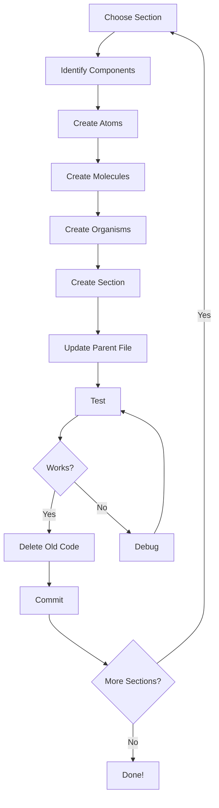

# Quick Reference - Atomic Design Refactor

## 📁 Folder Structure Template

```
src/app/components/
├── atoms/              # Smallest building blocks
│   ├── icons/         # SVG icons
│   ├── brand/         # Logo, brand elements
│   └── inputs/        # Basic input elements
├── molecules/          # Combinations of atoms
│   ├── checkboxes/    # Checkbox components
│   ├── buttons/       # Button components
│   └── [feature]/     # Feature-specific molecules
├── organisms/          # Complex components
│   ├── forms/         # Form assemblies
│   ├── navigation/    # Nav components
│   └── [feature]/     # Feature-specific organisms
└── sections/           # Full page sections
    └── [SectionName]Section.tsx
```

---

## 🎨 Atomic Design Levels

| Level | Description | Example | Lines | Dependencies |
|-------|-------------|---------|-------|--------------|
| **Atom** | Basic element | Icon, Input | 5-30 | None or SVG data |
| **Molecule** | Simple group | Checkbox with label | 20-50 | Atoms |
| **Organism** | Complex group | Form, Grid | 50-150 | Molecules + Atoms |
| **Section** | Page section | ContactSection | 30-80 | Organisms |

---

## 📝 Component Template

### Atom Template
```tsx
// /src/app/components/atoms/icons/IconName.tsx
import svgPaths from "../../../../../imports/svg-data";

export function IconName() {
  return (
    <div className="relative shrink-0 size-[45px]">
      <svg className="block size-full" fill="none" viewBox="0 0 45 45">
        <path d={svgPaths.pathName} stroke="#141311" />
      </svg>
    </div>
  );
}
```

### Molecule Template
```tsx
// /src/app/components/molecules/feature/ComponentName.tsx
import { IconName } from "../../atoms/icons/IconName";
import imgAsset from "figma:asset/hash.png";

function InternalComponent() {
  return <div>{/* Internal structure */}</div>;
}

export function ComponentName() {
  return (
    <div className="wrapper-classes">
      <p className="label-classes">Label Text</p>
      <InternalComponent />
    </div>
  );
}
```

### Organism Template
```tsx
// /src/app/components/organisms/feature/FeatureName.tsx
import { Component1 } from "../../molecules/feature/Component1";
import { Component2 } from "../../molecules/feature/Component2";

function Row1() {
  return (
    <div className="content-stretch flex gap-[24px]">
      <Component1 />
      <Component2 />
    </div>
  );
}

export function FeatureName() {
  return (
    <div className="container-classes">
      <Row1 />
      {/* More rows */}
    </div>
  );
}
```

### Section Template
```tsx
// /src/app/components/sections/SectionNameSection.tsx
import { Organism1 } from "../organisms/feature/Organism1";
import { Organism2 } from "../organisms/feature/Organism2";
import imgIcon from "figma:asset/hash.png";

export function SectionNameSection() {
  return (
    <div className="section-wrapper">
      <div className="icon-wrapper">
        
      </div>
      <Organism1 />
      <Organism2 />
    </div>
  );
}
```

---

## 🔗 Import Path Cheat Sheet

From a component's location, use these relative paths:

| From | To | Path |
|------|----|----|
| Atom | SVG data | `../../../../../imports/svg-file` |
| Atom | Asset | `figma:asset/hash.png` |
| Molecule | Atom | `../../atoms/category/AtomName` |
| Molecule | Asset | `figma:asset/hash.png` |
| Organism | Molecule | `../../molecules/category/MoleculeName` |
| Organism | Atom | `../../atoms/category/AtomName` |
| Section | Organism | `../organisms/category/OrganismName` |
| Section | Asset | `figma:asset/hash.png` |

**Remember:** `figma:asset` is a virtual module - never prefix with `./` or `../`!

---

## 🎨 Common Styling Patterns

### Inset Shadow (Container Effect)
```tsx
<div className="absolute inset-0 pointer-events-none shadow-[inset_24px_24px_0px_0px_rgba(255,255,255,0.5),inset_-24px_-24px_0px_0px_rgba(0,0,0,0.15)]" />
```

### Border Overlay
```tsx
<div aria-hidden="true" className="absolute border-2 border-[#141311] border-solid inset-0 pointer-events-none" />
```

### Background Container
```tsx
<div className="absolute inset-0 overflow-hidden pointer-events-none">
  
</div>
```

### Flex Layout (Stretch Content)
```tsx
<div className="content-stretch flex gap-[24px] items-center relative shrink-0 w-full">
```

### Fixed Width Container
```tsx
<div className="absolute left-1/2 translate-x-[-50%] w-[440px]">
```

---

## 🎯 Color Reference

| Name | Hex | Usage |
|------|-----|-------|
| Golden | `#D3BB51` | Inactive/hover states |
| Dark | `#141311` | Active states, text |
| Light Gray | `#f0f0f0` | Backgrounds |
| Muted Brown | `#817b6e` | Secondary text |

---

## 📐 Standard Dimensions

| Element | Size |
|---------|------|
| Section width | `440px` |
| Icon (small) | `24px × 24px` |
| Icon (large) | `45px × 45px` |
| Icon (nav) | `80px × 80px` |
| Checkbox | `45px × 45px` |
| Gap (standard) | `24px` |
| Gap (section) | `48px` |

---

## ✅ Extraction Checklist

When extracting a component:

- [ ] Create file in correct atomic level folder
- [ ] Copy component code
- [ ] Add necessary imports (relative paths!)
- [ ] Preserve all `figma:asset` imports
- [ ] Export component function
- [ ] Update parent component to import
- [ ] Test component renders correctly
- [ ] Delete old code from source file
- [ ] Commit changes

---

## 🚫 Common Mistakes to Avoid

1. ❌ `import img from "../../../figma:asset/hash.png"` 
   ✅ `import img from "figma:asset/hash.png"`

2. ❌ Changing Tailwind classes during extraction  
   ✅ Keep styling exactly as-is

3. ❌ Creating files without testing  
   ✅ Test after each component extraction

4. ❌ Forgetting to export component  
   ✅ Always `export function ComponentName()`

5. ❌ Nested default exports  
   ✅ Only use default export in Section components

6. ❌ Absolute imports  
   ✅ Use relative imports for components

---

## 🔄 Refactor Workflow



---

## 📊 Progress Tracker

| Section | Status | Components | Files Created |
|---------|--------|------------|---------------|
| **Contact** | ✅ Done | 30+ | 14 |
| Vloeren | ⏳ Pending | ~20 | ~7 |
| About | ⏳ Pending | ~15 | ~5 |
| Interieur | ⏳ Pending | ~12 | ~4 |
| Navigation | ⏳ Pending | ~8 | ~3 |
| Logo | ⏳ Pending | ~2 | ~2 |

**Total:** 14/35 files • 28.5% complete

---

## 💻 VSCode Snippets (Optional)

Add to `.vscode/snippets.code-snippets`:

```json
{
  "React Atom Component": {
    "prefix": "ratom",
    "body": [
      "export function ${1:ComponentName}() {",
      "  return (",
      "    <div className=\"${2:classes}\">",
      "      $0",
      "    </div>",
      "  );",
      "}"
    ]
  },
  "React Molecule Component": {
    "prefix": "rmol",
    "body": [
      "import { ${2:AtomName} } from \"../../atoms/${3:category}/${2:AtomName}\";",
      "",
      "export function ${1:ComponentName}() {",
      "  return (",
      "    <div className=\"${4:classes}\">",
      "      <${2:AtomName} />",
      "      $0",
      "    </div>",
      "  );",
      "}"
    ]
  }
}
```

---

## 🎓 Learning Resources

- **Atomic Design:** https://bradfrost.com/blog/post/atomic-web-design/
- **Component Structure:** See `COMPONENT_HIERARCHY.md`
- **Example:** Contact Section in `/src/app/components/sections/ContactSection.tsx`

---

**Keep this file open while refactoring!** 📌
